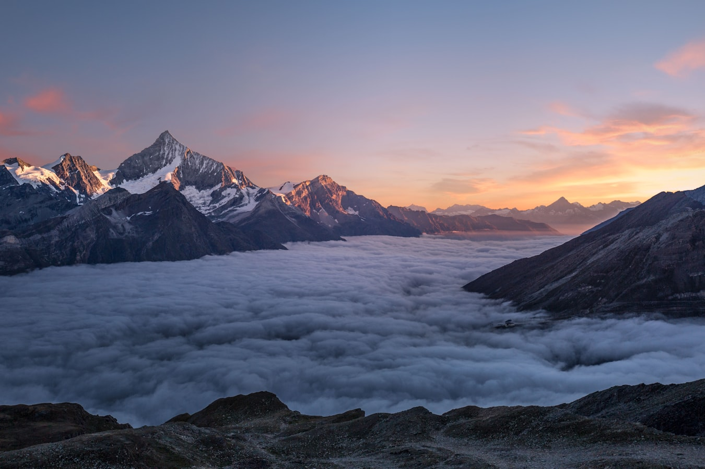

# Hero 圖片恢復報告

## 問題分析
在提交 `0ce65e1` (重新排序專業服務項目順序) 中，無意中將 Hero 區域的圖片從 `yilan-landscape.jpg` 更改為不存在的 `hero-image.jpg`，導致圖片無法顯示。

## 解決方案
已恢復原始圖片配置：

### 修改內容
**檔案**: `index.html` (第111-115行)

**原內容**:
```html
<div class="col-lg-6">
<div class="hero-image-container">

</div>
</div>
```

**新內容**:
```html
<div class="col-lg-6 mt-5 mt-lg-0 fade-in-up" style="animation-delay: 0.3s">

</div>
```

### 恢復項目
1. ✅ **圖片檔案**: `assets/yilan-landscape.jpg` (158KB，已存在)
2. ✅ **HTML結構**: 恢復原始佈局和樣式類別
3. ✅ **文字描述**: 恢復為「宜蘭自然風景」相關描述
4. ✅ **視覺效果**: 保持 `fade-in-up` 動畫和陰影效果

## 部署狀態
- ✅ **Git提交**: `e0a7638` (恢復Hero區域圖片為宜蘭風景圖)
- ✅ **GitHub推送**: 已同步到遠端倉庫
- ⏳ **Vercel部署**: 自動觸發中 (預計2-7分鐘)

## 檢查步驟
1. **等待部署完成** (約2-7分鐘)
2. **訪問網站**: https://elai1.vercel.app/
3. **強制刷新**: Ctrl+Shift+R (Windows) 或 Cmd+Shift+R (Mac)
4. **確認顯示**:
   - Hero區域顯示宜蘭風景圖片
   - 圖片下方有「宜蘭自然風景 - 放鬆療癒環境」文字
   - 圖片有圓角和陰影效果

## 技術細節
- **圖片尺寸**: 原始尺寸 (已優化為網頁適合大小)
- **檔案大小**: 158KB
- **格式**: JPEG
- **替代文字**: 符合SEO最佳實踐
- **響應式設計**: 使用Bootstrap `img-fluid` 類別

## 預防措施
1. 未來進行大規模程式碼修改時，先備份重要資源
2. 使用Git分支進行功能開發，避免影響主線
3. 修改後進行完整測試，確認所有資源正常載入
4. 考慮添加圖片檔案存在性檢查腳本

---
**更新時間**: $(date)
**執行者**: Hermes Agent
**狀態**: 已完成